# Mockingbird SV Platform — User Guide

**Version:** Phase 1  
**Audience:** SV Team members and Admin users  
**Portal URL:** Ask your admin for the internal URL

---

## Table of Contents

- [1. Roles and Permissions](#1-roles-and-permissions)
- [2. Signing In](#2-signing-in)
- [3. Dashboard](#3-dashboard)
- [4. Creating a Project](#4-creating-a-project) *(Admin / SV_TEAM)*
- [5. Project Detail Page](#5-project-detail-page)
- [6. Uploading a Stub File](#6-uploading-a-stub-file)
- [7. Job Status](#7-job-status)
- [8. Admin Panel — Managing Users](#8-admin-panel--managing-users) *(Admin only)*
- [9. Admin Panel — Audit Log](#9-admin-panel--audit-log) *(Admin only)*
- [10. Signing Out](#10-signing-out)
- [Appendix A — Supported Input Formats](#appendix-a--supported-input-formats)
- [Appendix B — Project Status Reference](#appendix-b--project-status-reference)

---

## 1. Roles and Permissions

| Role | What they can do |
|------|-----------------|
| **ADMIN** | Everything: create users, view audit log, manage all projects |
| **SV_TEAM** | Create projects, upload stubs, view all projects |
| **PROJECT_OWNER** | Upload stubs and view their own projects only |
| **VIEWER** | Read-only access to projects assigned to them |

Your role is shown in the top-right corner of every page next to your username.

---

## 2. Signing In

Open the Mockingbird portal URL in your browser. You will see the login page.

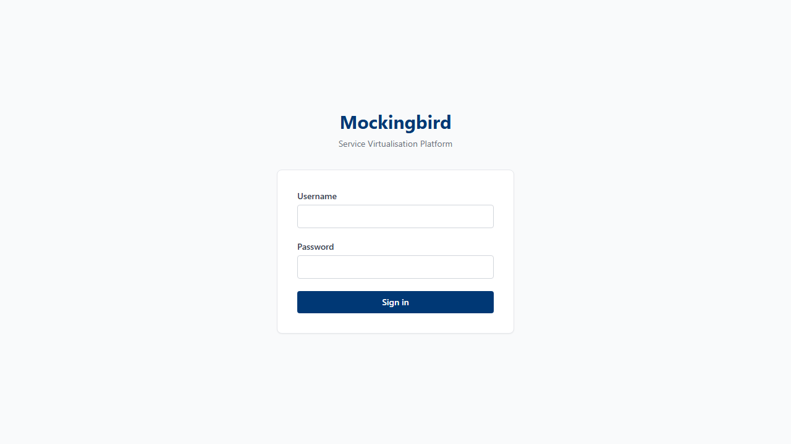

**Steps:**

1. Enter your **username** in the first field
2. Enter your **password** in the second field

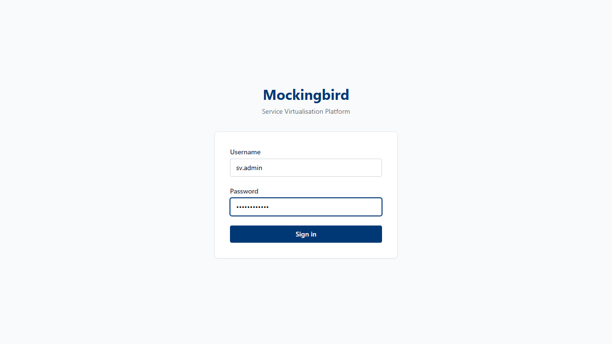

3. Click **Sign in**

> **First time?** Your admin will give you your username and a temporary password. You will be able to change your password after logging in via the Admin panel.

> **Forgot your password?** Ask an ADMIN user to reset it for you via the Admin → Users panel.

If your credentials are incorrect, you will see a red error message beneath the form. Check your username and password and try again.

---

## 3. Dashboard

After signing in you land on the **Dashboard** — a list of all the projects you have access to.

### Admin view (all projects visible)

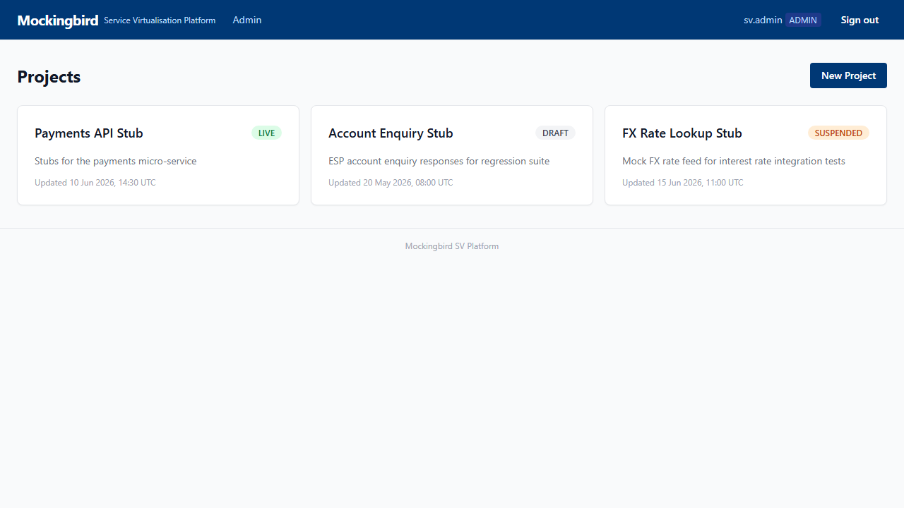

### SV Team / User view (projects visible to your role)

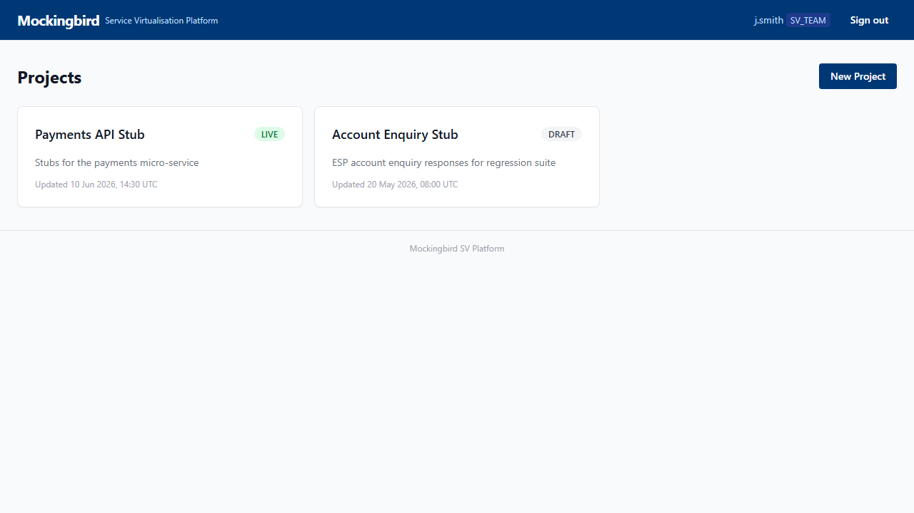

**What you see on each project card:**

| Element | Description |
|---------|-------------|
| **Project name** | Click to open the project detail page |
| **Status badge** | Current state of the project (LIVE, DRAFT, SUSPENDED, etc.) |
| **Description** | Optional one-line description set when the project was created |
| **Last updated** | When the project was last modified |

**Toolbar buttons (top-right):**

- **New Project** — visible to ADMIN and SV_TEAM only. Opens the create-project form.

> **No projects yet?** You will see an empty state with a "Create your first project" prompt. Click **New Project** to get started.

---

## 4. Creating a Project

> **Who can do this:** ADMIN and SV_TEAM roles.

From the dashboard, click the **New Project** button in the top-right corner.

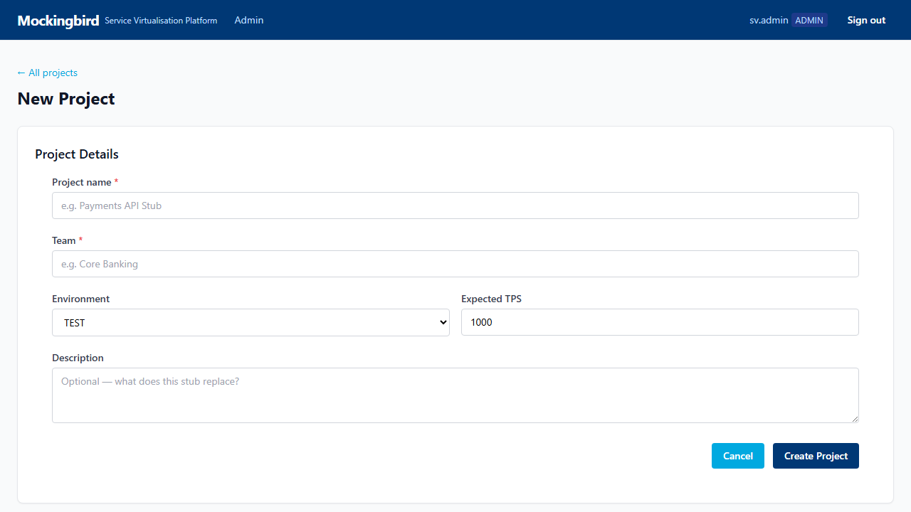

Fill in the form fields:

| Field | Required | Description |
|-------|----------|-------------|
| **Project name** | Yes | A short descriptive name (e.g. "Payments API Stub") |
| **Team** | Yes | Your team or business area (e.g. "Core Banking") |
| **Environment** | Yes | Select from: TEST, STAGING, UAT, PERF, PROD |
| **Expected TPS** | Yes | Your peak transaction rate target. Enter a number between 1 and 50,000. This determines which EC2 instance type gets provisioned. |
| **Description** | No | Optional notes about what this stub is for |

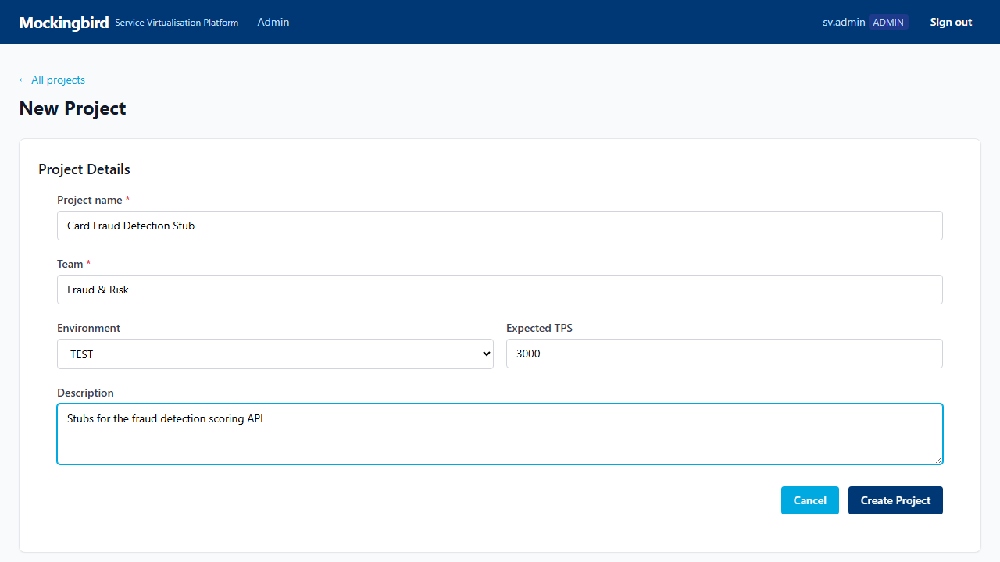

Click **Create Project**. The project is created in **DRAFT** status and you are taken to the project detail page.

> **TPS guidance:**
> - Up to 5,000 TPS → `c6i.xlarge` (cost-saving)
> - 5,001 – 18,000 TPS → `c6i.2xlarge` (standard)
> - Above 18,000 TPS → contact the SV team for a custom sizing

---

## 5. Project Detail Page

Click any project card on the dashboard to open its detail page.

### Admin view — LIVE project

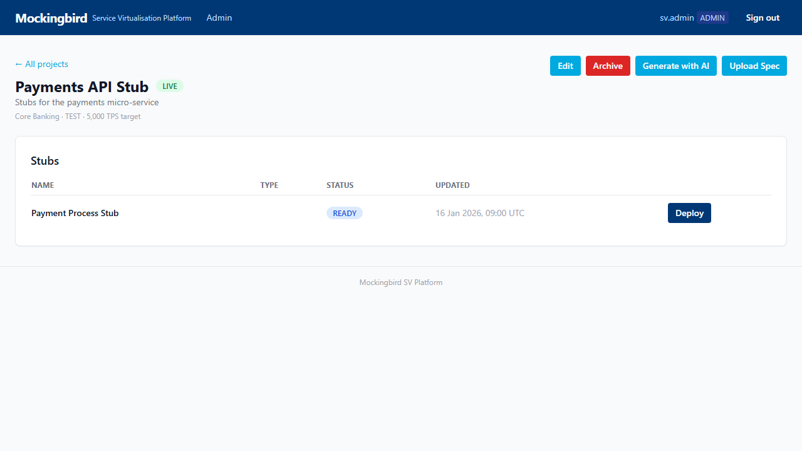

### User view — DRAFT project (no stubs yet)

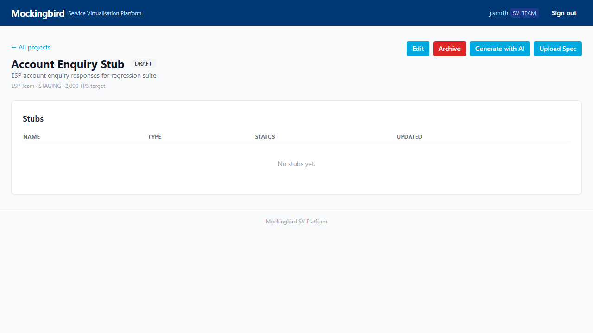

**Sections on the detail page:**

| Section | Description |
|---------|-------------|
| **Status badge** | Current project lifecycle state |
| **Stub URL** | The HTTPS endpoint your team uses to call the virtual service (only shown when LIVE) |
| **API Key** | The key your team sends in the `X-API-Key` header (only shown when LIVE) |
| **Stubs** | List of all stub files uploaded to this project |
| **Upload Spec File** | Button to add a new stub file |

---

## 6. Uploading a Stub File

From the project detail page, click **Upload Spec File**.

**Steps:**

1. **Stub name** — give this stub a descriptive name (e.g. "Payment Process Stub v2"). This is optional; if left blank the filename is used.

2. **Drag and drop** your spec file onto the upload zone, or click the zone to open a file browser.

   Accepted formats:
   - CA LISA HTTP capture pair (two `.txt` files — request + response — or a `.zip` containing them)
   - JSON stub definition
   - Postman v2.1 collection (`.json`)

   See [Appendix A](#appendix-a--supported-input-formats) for format details.

3. Once a file is selected the **Upload & Generate** button activates.

4. Click **Upload & Generate**.

   The platform:
   - Parses your file and validates the format
   - Generates WireMock stubs inside a Spring Boot project
   - Queues a CI/CD build job
   - Redirects you to the **Job Status** page

> **Validation errors?** If your file is in an unsupported format or contains errors, a red alert box appears below the drop zone listing what is wrong. Correct your file and try again.

---

### User upload flow (same steps, different project)

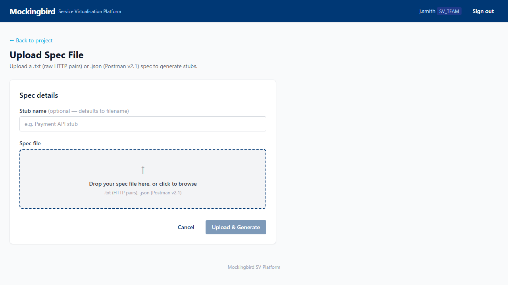

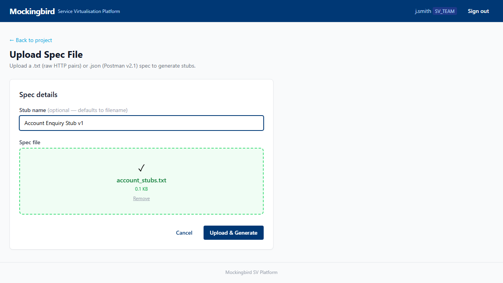

---

## 7. Job Status

After upload the system automatically redirects you to the **Job Status** page.

| Status | Meaning |
|--------|---------|
| **QUEUED** | Job is waiting in the build queue |
| **RUNNING** | GitLab CI is building and deploying the stub container |
| **DONE** | Stub is live — go back to the project to find the URL and API key |
| **FAILED** | Build failed — an error message explains what went wrong |

The page refreshes automatically every 5 seconds. For a DONE job, a **Back to Project** link takes you directly to the project detail page where the stub URL and API key are now visible.

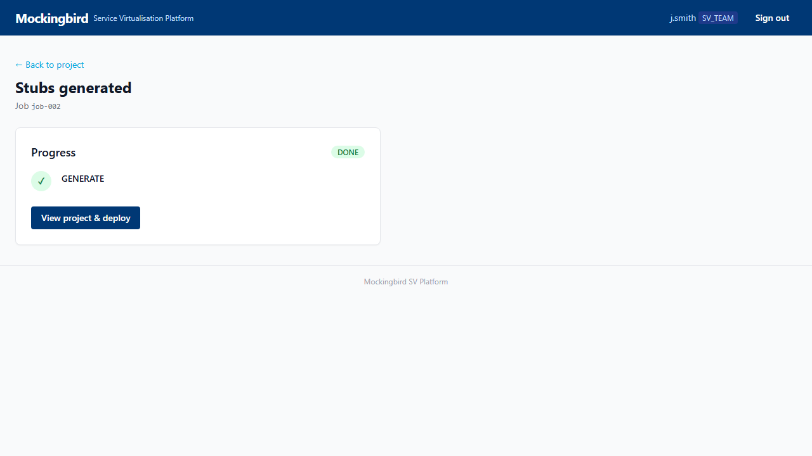

---

## 8. Admin Panel — Managing Users

> **Who can do this:** ADMIN role only.

Click **Admin** in the top navigation bar (only visible to ADMINs).

The **Users** tab shows all registered accounts with their role, active/suspended status, and join date.

### Changing a user's role

Use the **Role** dropdown next to any user to change their role. The change takes effect immediately (no save button needed).

### Suspending / reactivating a user

Click the green **Active** badge (or grey **Suspended** badge) to toggle a user's access. A suspended user cannot log in.

### Creating a new user

Click **New User** to open the create-user form.

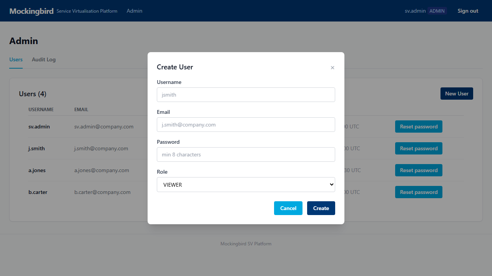

Fill in:

| Field | Description |
|-------|-------------|
| **Username** | The login name (e.g. `j.smith`). Cannot be changed later. |
| **Email** | The user's company email address |
| **Password** | A temporary password — minimum 8 characters. Tell the user to change it after first login. |
| **Role** | Select the appropriate role (see [Section 1](#1-roles-and-permissions)) |

Click **Create**. The new user appears in the users table.

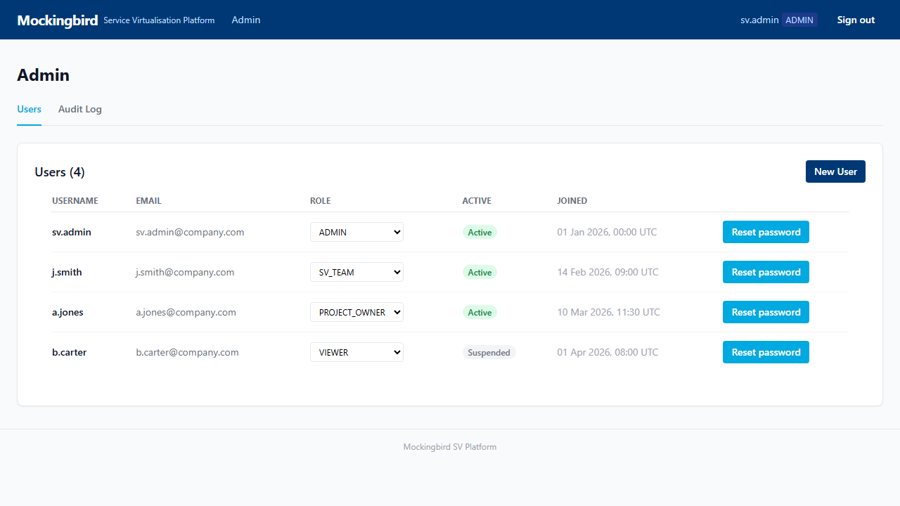

### Resetting a password

Click **Reset password** next to any user, enter the new temporary password, and click **Reset**. Tell the user their new password securely (e.g. via Teams direct message).

---

## 9. Admin Panel — Audit Log

> **Who can do this:** ADMIN role only.

From the Admin panel, click the **Audit Log** tab.

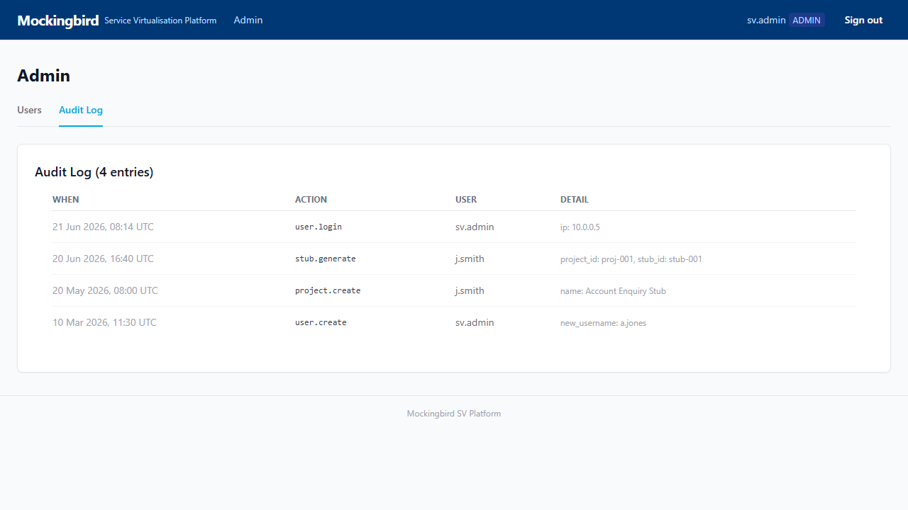

The audit log records every significant action in the platform:

| Column | Description |
|--------|-------------|
| **When** | Date and time of the action |
| **Action** | Machine-readable event code (e.g. `user.login`, `stub.generate`) |
| **User** | Username of who performed the action |
| **Detail** | Key/value context (e.g. project ID, stub name, IP address) |

The log is read-only and cannot be modified or deleted.

---

## 10. Signing Out

Click **Sign out** in the top-right corner of any page.

Your session is immediately invalidated and you are redirected to the login page. Closing your browser tab also ends the session.

---

## Appendix A — Supported Input Formats

### CA LISA / IBM Rational Test Workbench HTTP capture

The **primary** format. Generated by CA LISA HTTP capture recordings.

**Two variants are supported:**

| Variant | How to identify | What to upload |
|---------|-----------------|----------------|
| **ESP** | No section labels — raw `={Method="POST" URL=...}` syntax | Upload as a `.zip` containing the `_Request_` and `_Response_` text files together |
| **Wealth** | Explicit `RequestHeader:` / `ResponseHeader:` labels | Same — zip the pair |

**CA LISA variables** (`%%X-Interaction-Id%%`) are automatically converted to WireMock Handlebars expressions that echo the request header value back in the response.

### JSON stub definition

A structured JSON file following the Mockingbird stub schema. Suitable for hand-crafted or programmatically generated stubs.

### Postman collection (v2.1)

Export your Postman collection with **saved responses** enabled. Mockingbird reads each request/response pair and creates a WireMock mapping for it.

---

## Appendix B — Project Status Reference

| Status | Description | Next action |
|--------|-------------|-------------|
| **DRAFT** | Project created, no stubs uploaded yet | Upload a spec file |
| **READY** | Stubs uploaded and validated, not yet deployed | Deploy from the project page |
| **DEPLOYING** | GitLab CI build is running | Wait for LIVE status |
| **LIVE** | Stub is deployed and accepting traffic | Use the Stub URL + API Key |
| **SUSPENDED** | EC2 terminated to save cost; stubs are preserved in the database | Click Redeploy — live again in ~4 minutes |
| **ARCHIVED** | Project is permanently closed | No further action possible |

---

*Mockingbird SV Platform — Internal documentation*  
*Maintained by the SV Team*
